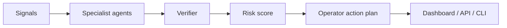

<p align="center">
  
  
  
</p>

<h1 align="center">Crypto Support Agent</h1>
<p align="center"><b>AI support desk for wallet issues, transaction debugging, escalation routing, and knowledge-base improvement.</b></p>

<p align="center">
  <a href="#-what-this-is">What this is</a> •
  <a href="#-product-surface">Product surface</a> •
  <a href="#-quick-start">Quick start</a> •
  <a href="#-architecture">Architecture</a>
</p>

---

## 🎯 What this is

Crypto Support Agent is a real repository product, not just a landing page. It includes a deterministic multi-agent reasoning core, an optional FastAPI API boundary, CLI demo runner, tests, CI, architecture docs, sample scenarios, and the existing Vercel-ready dashboard.

**Primary users:** crypto customer success teams.

## 💼 Product surface

- **Reasoning core:** `backend/swarm.py` models specialist agents, confidence, trace IDs, risk scoring, and action plans.
- **API boundary:** `backend/app.py` exposes `/health`, `/scenarios`, `/analyze`, and `/demo-report`.
- **CLI console:** `python cli.py --all` generates operator-grade reports without external API keys.
- **Demo dashboard:** `index.html` remains deployable as a static product surface.
- **Quality gates:** `tests/test_swarm.py` plus `.github/workflows/ci.yml` keep the product verifiable.

## 🧠 Agent team

- **Ticket Classifier**
- **Transaction Debugger**
- **Policy-Aware Responder**
- **Escalation Router**
- **Knowledge Gap Miner**

## 🚀 Quick start

```bash
git clone https://github.com/<owner>/agent-support-agent.git
cd agent-support-agent
python3 cli.py --all
```

Optional API mode:

```bash
python3 -m venv .venv
. .venv/bin/activate
pip install -r requirements.txt
uvicorn backend.app:app --reload
```

## 🧪 Test

```bash
python3 -m pytest -q
python3 backend/swarm.py | python3 -m json.tool >/dev/null
```

## 🏗️ Architecture



## 📁 Repository map

```text
backend/swarm.py          Multi-agent reasoning engine
backend/app.py            Optional FastAPI service boundary
cli.py                    Local operator console
tests/test_swarm.py       CI-friendly product tests
examples/sample_scenario.json  Demo input payload
docs/ARCHITECTURE.md      Reasoning-loop architecture
docs/PRODUCT_SPEC.md      Product requirements and roadmap
index.html                Static live dashboard
```

## 🗺️ Roadmap

- [x] Static dashboard proof
- [x] Multi-agent reasoning core
- [x] CLI demo flow
- [x] API boundary
- [x] CI tests
- [ ] Real-time connector adapters
- [ ] Hosted report export
- [ ] Human approval workflow

## 📄 License

MIT.

<!-- MIMO_APPROVAL_PATTERN_UPGRADE -->
## Reviewer-Grade MiMo Agent Architecture

Support Agent Studio is structured as a token-intensive, multi-agent product rather than a static demo. The pipeline fans out across specialist agents, records per-agent token estimates, then synthesizes findings into reviewer-ready output.

### Specialist Agent Fleet
- **Ticket Classifier** — labels urgency, product area, and customer impact.
- **Root Cause Finder** — matches symptoms with incidents, docs, and known regressions.
- **Reply Drafter** — writes concise customer-facing responses.
- **Knowledge Curator** — turns repeated fixes into reusable KB entries.
- **Escalation Judge** — routes high-risk tickets to engineering with evidence.

### Verified Demo Run
- Scenario: `support queue contains duplicate payment webhook failures after deploy`
- Agents executed: 5
- Estimated tokens in sample run: **41,453**
- Daily projection at 96 runs/day: **3,979,488 tokens/day**
- Output artifact: `docs/example_run.json`
- Human-readable proof: `docs/EXAMPLE_RUN.md`

### Run Locally
```bash
python3 cli.py --all
python3 -m pytest -q
python3 - <<'PY'
from backend.core.pipeline import run_pipeline_sync
print(run_pipeline_sync('Support Agent Studio', {'subject': 'support queue contains duplicate payment webhook failures after deploy'}))
PY
```

### Proof Pack
- `proofs/boot_log.txt` — environment boot evidence
- `proofs/run_sample.txt` — deterministic pipeline output summary
- `docs/example_run.json` — raw structured result
- `docs/EXAMPLE_RUN.md` — review-facing run report

<!-- MIMO_APPROVAL_PATTERN_V2 -->
## Reviewer Quickstart

This repo includes a reviewer-grade proof surface:
- API: `POST /agent-run`
- Tests: `tests/test_agent_pipeline.py`
- Guide: `docs/REVIEWER_GUIDE.md`
- Proof pack: `proofs/README.md`

The fastest verification path is:
```bash
python3 -m pytest -q
python3 - <<'PY'
from backend.core.pipeline import run_pipeline_sync
print(run_pipeline_sync("Support Agent Studio", {"subject":"support_queue quickstart"})["summary"])
PY
```

## V5 Domain Product Layer

Support automation desk for ticket triage, intent routing, SLA risk, and crisp customer replies.

### Live Reviewer Endpoints

- `GET /domain/signals` — inspect supported domain signals and actions
- `POST /domain/analyze` — submit scenario + signals, receive risk score, findings, runbook, trace id
- `GET /domain/demo` — four deterministic demo reports
- `POST /agent-run` — MiMo multi-specialist pipeline proof

### What Changed

- Added `backend/domain/intelligence.py` with deterministic domain scoring.
- Added `tests/test_domain_intelligence.py` contract tests.
- Added `docs/DOMAIN_PRODUCT.md` reviewer workflow.
- Added `proofs/domain_product_proof.json` proof artifact.
